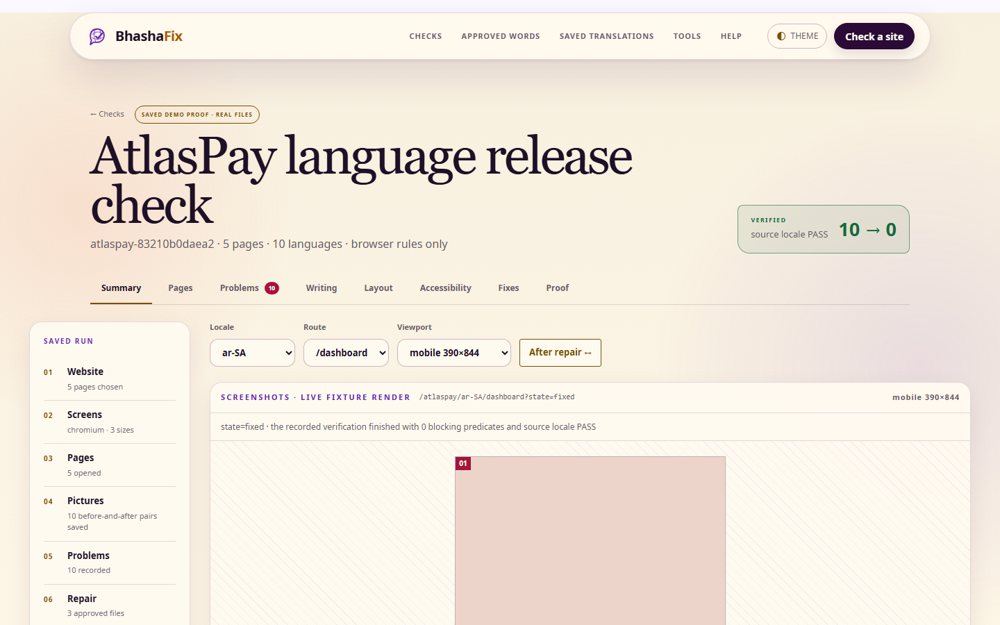
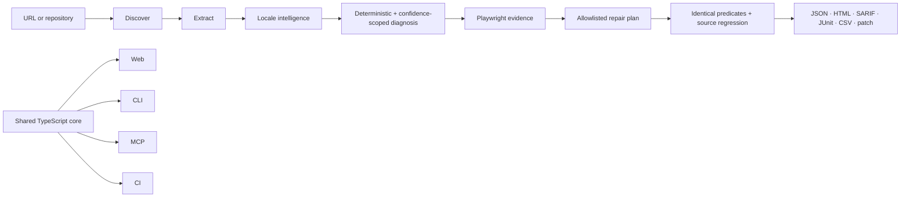

# BhashaFix

**Every language. Every viewport. Evidence before release.**

BhashaFix is the verification harness between AI-generated translations and
production software. Translation systems translate strings; BhashaFix tests
whether those strings are linguistically appropriate, technically valid,
visually usable, accessible, and safe to ship.

> Test, repair and prove every language before it reaches production.

[Live deterministic replay](https://bhashafix.vercel.app) ·
[Architecture](ARCHITECTURE.md) · [Security](SECURITY.md) ·
[Contributing](CONTRIBUTING.md)



## The problem

A translation can be correct while the rendered product is broken. Devanagari
glyphs clip, German calls-to-action overflow, Arabic remains left-to-right,
placeholders are corrupted, raw keys leak, fonts miss glyphs, and accessibility
regresses. A model message saying “fixed” is not proof.

## The solution

BhashaFix shares one locale-agnostic engine across four surfaces:

- Web review workspace with route/locale evidence, before/after previews, repair
  diffs, and portable reports.
- `@bhashafix/cli` with stable exit codes and human or JSON output.
- `@bhashafix/mcp` with strict schemas, read-only evidence tools, and guarded
  repair tools.
- GitHub Actions release gate with browser evidence and configurable severity.

The bundled AtlasPay target proves a genuine deterministic loop:

```text
10 verified failures → bounded three-file repair → 0 blocking failures
→ source-locale regression PASS
```

The ten baseline failures cover Hindi clipping, German expansion, Arabic
direction, Hebrew icon order, a Japanese raw key, Chinese font coverage, Thai
wrapping, a French placeholder mismatch, Spanish terminology, and English page
metadata.

## Ten-minute quick start

Requirements: Node.js 22.13+ and pnpm 10.

```bash
pnpm install
pnpm exec playwright install chromium
pnpm dev
```

Open `http://localhost:3000`, then use:

- `/` — product story and website-scan entry point.
- `/scan/new` — five-step scan configuration.
- `/scan/atlaspay-replay` — real 10→0 evidence workspace.
- `/scan/atlaspay-replay/report` — proof report and exports.
- `/atlaspay/ar-SA/dashboard?state=broken` — inspectable broken fixture.
- `/atlaspay/ar-SA/dashboard?state=fixed` — repaired fixture.

Reproduce the proof locally:

```bash
pnpm demo:reset
pnpm demo:scan
pnpm demo:repair
pnpm demo:prove
```

## Scan a real site in a real browser

`scan --url` launches a real browser, renders every route × locale × viewport,
measures the rendered DOM, runs axe, and writes screenshots and DOM snapshots
to `.bhashafix/scans/<scanId>/`.

```bash
pnpm bhashafix doctor
pnpm bhashafix scan --url https://example.com --locales en-GB,de-DE,ar-SA --viewports mobile,desktop --verbose
```

Every issue carries the measurement that produced it, for example
`scrollWidth 212 / clientWidth 144 / overflowPx 68`, together with the predicate
that was evaluated. Set `BHASHAFIX_BROWSER_WS_ENDPOINT` to render through a
remote browser instead of a local install, or `--browsers firefox|webkit` to
render through a different engine.

Accuracy is measured, not asserted. `pnpm benchmark` scans a generated
twelve-locale fixture site carrying 70 labelled defects across 12 rule families
and scores the engine against that ground truth over 288 real browser renders.
The receipt is written to `artifacts/benchmark.json`, and the run fails the
build if recall drops below 100%, precision below 95%, or the clean variant
produces any finding.

## Scan a website

The hosted form accepts a public HTTP(S) URL and applies protocol, DNS,
redirect, response-size, timeout, rate, and private-network controls.

```bash
pnpm bhashafix crawl --url https://example.com
pnpm bhashafix extract --url https://example.com --json
```

Hosted scans cannot bypass authentication, robots policy, anti-automation
controls, inaccessible APIs, or crawling prohibitions. Localhost is allowed only
in explicitly local CLI mode.

## Scan a local repository

```bash
pnpm bhashafix inspect --project /absolute/path/to/project
pnpm bhashafix scan \
  --project /absolute/path/to/project \
  --source-locale en-GB \
  --locales hi-IN,ar-SA,ja-JP,de-DE \
  --viewports mobile,desktop
```

Next.js is the fully supported repository path. The hosted public-URL scan
performs a real SSRF-safe fetch, follows bounded same-origin links, respects an
available robots policy, and reports per-route static-text, metadata, raw-key,
title and image-alt evidence for up to five HTML routes. JavaScript browser
rendering, viewport checks, axe, authenticated coverage and repair remain
local/worker functionality. Vite React, Remix, Astro, Nuxt, Vue, SvelteKit,
and static HTML discovery return honest experimental-support results. Unknown
project scripts are reported, never silently executed.

Run the same public-product smoke used for release evidence against a local
production build:

```bash
pnpm scan:live:smoke
```

## CLI

```bash
pnpm bhashafix --help
pnpm bhashafix doctor
pnpm bhashafix locales --json
pnpm bhashafix translate-preview --locale ar-SA \
  --text "Pay {amount} with AtlasPay"
pnpm bhashafix scan --json --no-ai --output artifacts/baseline.json
pnpm bhashafix issues --json
pnpm bhashafix repair --dry-run
pnpm bhashafix verify --changed-only
pnpm bhashafix ci \
  --config .bhashafix/config.yml \
  --fail-on blocking \
  --output artifacts/ci.json
```

Exit codes are stable: `0` passed, `1` verified blocking issues, `2` invalid
configuration, `3` target unavailable, `4` scanner/runtime failure, and `5`
provider failure with no fallback.

## MCP integration

Build the publishable STDIO server:

```bash
pnpm build:packages
node packages/mcp/dist/bin.js
```

Codex (`~/.codex/config.toml`):

```toml
[mcp_servers.bhashafix]
command = "node"
args = ["/absolute/path/to/bhashafix/packages/mcp/dist/bin.js"]
```

Claude Code:

```bash
claude mcp add --transport stdio bhashafix -- \
  node /absolute/path/to/bhashafix/packages/mcp/dist/bin.js
```

Generic client:

```json
{
  "mcpServers": {
    "bhashafix": {
      "command": "node",
      "args": ["/absolute/path/to/bhashafix/packages/mcp/dist/bin.js"]
    }
  }
}
```

The server exposes 18 strict tools, project/scan/issue/report resources, and five
localisation prompts. Mutation requires an explicit scan ID and issue IDs,
enforces the project root and path allowlist, rejects symlinks, returns the
planned unified diff, supports dry run, and never commits automatically.

Validate the built STDIO surface with independent clients:

```bash
pnpm mcp:inspect
pnpm mcpc:smoke
```

## CI

Copy [`.github/workflows/bhashafix.yml`](.github/workflows/bhashafix.yml). It
installs Chromium dependencies, builds the web/CLI/MCP surfaces, runs all
quality gates, performs the configured severity gate, writes a job summary, and
uploads screenshots and portable reports.

## Architecture



See [ARCHITECTURE.md](ARCHITECTURE.md) for package boundaries and trust zones.

## Security and privacy

BhashaFix implements SSRF and redirect checks, hosted private-network blocking,
response/time limits, secret redaction, file-path confinement, symlink
protection, an explicit repair allowlist, rollback, CSP, audit records, and
provider-data minimisation. No model key is needed for deterministic or replay
mode. See [SECURITY.md](SECURITY.md).

## Supported and experimental capabilities

| Capability | MVP status |
|---|---|
| AtlasPay deterministic 10→0 proof | Verified |
| Next.js repository discovery | Supported |
| Generic public URL fetch/extraction | Supported with documented limits |
| BCP 47 + Unicode + `Intl` locale profiles | Supported |
| Sandboxed synthetic localisation preview | Supported and explicitly labelled |
| Packed CLI/MCP clean-consumer install | Verified by `pnpm pack:verify` |
| Official MCP Inspector + MCPC invocation | Verified |
| Chromium browser rendering | Verified; full 288-render benchmark |
| Hosted browser scan in the Vercel function | Verified; bounded to one route, two locales, one viewport |
| Firefox and WebKit rendering | Verified via `--browsers`; deterministic rules agree with Chromium, axe findings differ |
| Vite/Remix/Astro/Nuxt/Vue/SvelteKit/static discovery | Experimental |
| Provider-independent AI adapters | Interface + no-model mode |
| Arbitrary autonomous business-logic repair | Not supported |
| Remote MCP, teams, billing, SSO | Roadmap |

## Truthful language positioning

BhashaFix supports Unicode content and user-selected BCP 47 locales through a
provider-independent localisation pipeline. Deterministic engineering checks
are authoritative. Linguistic judgements include confidence levels and
human-review gates.

The representative registry covers Latin, Cyrillic, Arabic, Hebrew, Persian,
Devanagari, Bengali, Tamil, Ethiopic, Simplified Chinese, Traditional Chinese,
Japanese, Korean, Thai, Vietnamese, and Indonesian while the engine remains
locale-agnostic.

Perfect native-language quality is outside the product claim. General coding agents
reason broadly; BhashaFix gives them a specialised, reproducible localisation
harness containing browser evidence, locale constraints, terminology,
translation memory, and pass/fail verification.

## Quality gate

```bash
pnpm lint
pnpm typecheck
pnpm test
pnpm test:integration
pnpm test:cli
pnpm test:mcp
pnpm build
pnpm pack:verify
pnpm mcp:inspect
pnpm mcpc:smoke
pnpm test:e2e
pnpm verify
pnpm submission:prepare
```

Important behaviour is asserted through predicates and browser checks, not
snapshot files alone.

## Contributing

Read [CONTRIBUTING.md](CONTRIBUTING.md), the
[Code of Conduct](CODE_OF_CONDUCT.md), and [Security Policy](SECURITY.md).
Issues and focused pull requests are welcome.

## Hackathon build disclosure

This repository was built as a ChatGPT Codex hackathon project. Codex was used
for architecture, implementation, tests, browser inspection, debugging,
documentation, deck generation, and release verification. The replay artifacts
were generated by the real deterministic engine; they are labelled replay and
are not fabricated live telemetry. No customers, revenue, partnerships,
benchmarks, stars, or submission confirmation are claimed.

## License

Apache-2.0. See [LICENSE](LICENSE).
